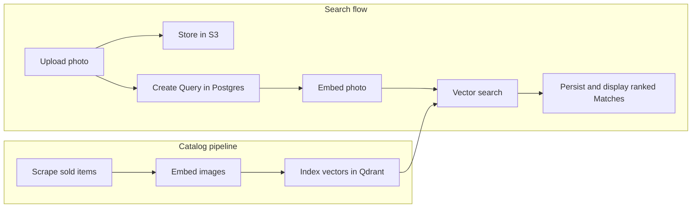

# Examen

### Visual search for sold auction items

Examen turns an uploaded photo into a ranked list of visually similar items from Auctionet's sold archive. It combines multimodal embeddings with vector search, then returns each match with its realized price and original listing.

Built as a full-stack thesis project—from data collection and embedding pipelines to search, persistence, and deployment.

## Highlights

- Built an end-to-end image retrieval pipeline: scrape, normalize, embed, index, search, and rank.
- Designed semantic image search with 3072-dimensional Gemini embeddings and cosine similarity in Qdrant.
- Separated storage by responsibility: vectors in Qdrant, application state in Postgres, and user uploads in S3.
- Preserved historical match metadata in Postgres so results remain stable if the source catalog changes.
- Documented consequential design choices as [architecture decision records](./docs/adr/).

## Tech stack

**Frontend:** Next.js 16, React 19, TypeScript, Tailwind CSS, Motion  
**Backend:** Next.js Route Handlers, Drizzle ORM, PostgreSQL  
**Search & AI:** Qdrant, Gemini multimodal embeddings via OpenRouter  
**Infrastructure:** S3-compatible object storage, Railway  
**Quality:** Vitest, Testing Library, ESLint, Prettier

## How it works



Reference images remain on Auctionet's CDN. Only user uploads are stored in S3, avoiding duplicate media storage.

## Run locally

### Prerequisites

- Node.js 20+
- pnpm
- PostgreSQL
- Qdrant
- S3-compatible object storage
- OpenRouter API key

### Setup

```bash
pnpm install

# Create .env with the variables below
pnpm exec drizzle-kit push
pnpm dev
```

Open [localhost:3000](http://localhost:3000).

```bash
DATABASE_URL=postgresql://...
QDRANT_URL=https://...
OPENROUTER_API_KEY=...
AWS_REGION=...
AWS_ACCESS_KEY_ID=...
AWS_SECRET_ACCESS_KEY=...
AWS_BUCKET_NAME=...
```

## Build the searchable catalog

```bash
# 1. Scrape sold Auctionet items
pnpm scrape:auctionet -- \
  --url "https://auctionet.com/en/search/9-ceramics-porcelain?is=ended" \
  --out data/auctionet/items

# 2. Generate image embeddings
pnpm embed:auctionet-vectors -- \
  --items-dir data/auctionet/items \
  --out-dir data/auctionet/vectors

# 3. Seed Qdrant
pnpm seed:references -- \
  --vectors-dir data/auctionet/vectors \
  --items-dir data/auctionet/items
```

The pipeline writes resumable JSON artifacts to `data/auctionet/`, making each stage independently inspectable and repeatable.

## Project documentation

- [Domain model](./CONTEXT.md)
- [Architecture decisions](./docs/adr/)
- [Qdrant selection](./docs/adr/0002-qdrant-for-vector-storage.md)
- [Match generation lifecycle](./docs/adr/0003-page-driven-match-generation.md)
- [Deterministic vector IDs](./docs/adr/0004-deterministic-qdrant-reference-point-ids.md)

## Scripts

```bash
pnpm dev                        # Start the development server
pnpm build                      # Create a production build
pnpm test                       # Run tests
pnpm lint                       # Run ESLint
pnpm scrape:auctionet           # Collect sold Auctionet items
pnpm embed:auctionet-vectors    # Generate catalog embeddings
pnpm seed:references            # Seed the Qdrant catalog
```
