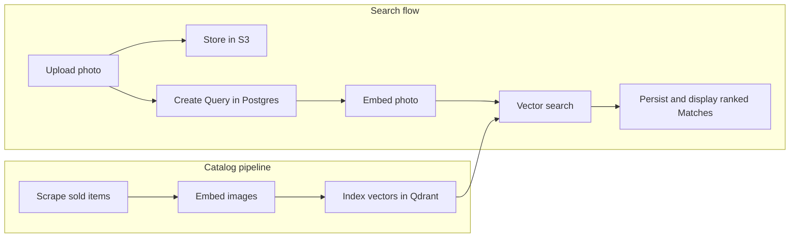

# Examen

### Visual search for sold auction items

Examen turns an uploaded photo into a ranked list of visually similar items from Auctionet's sold archive. It combines multimodal embeddings with vector search, then returns each match with its realized price and original listing.

Built as a full-stack thesis project—from data collection and embedding pipelines to search, persistence, and deployment.

## Highlights

- Built an end-to-end image retrieval pipeline: scrape, normalize, embed, index, search, and rank.
- Designed semantic image search with 3072-dimensional Gemini embeddings and cosine similarity in Qdrant.
- Separated storage by responsibility: vectors in Qdrant, application state in Postgres, and user uploads in S3.
- Preserved historical match metadata in Postgres so results remain stable if the source catalog changes.
- Documented consequential design choices as [architecture decision records](./docs/adr/).

## Tech stack

**Frontend:** Next.js 16, React 19, TypeScript, Tailwind CSS, Motion  
**Backend:** Next.js Route Handlers, Drizzle ORM, PostgreSQL  
**Search & AI:** Qdrant, Gemini multimodal embeddings via OpenRouter  
**Infrastructure:** S3-compatible object storage, Railway  
**Quality:** Vitest, Testing Library, ESLint, Prettier

## How it works



Reference images remain on Auctionet's CDN. Only user uploads are stored in S3, avoiding duplicate media storage.

## Run locally

### Prerequisites

- Node.js 20+
- pnpm
- PostgreSQL
- Qdrant
- S3-compatible object storage
- OpenRouter API key

### Setup

```bash
pnpm install

# Create .env with the variables below
pnpm exec drizzle-kit push
pnpm dev
```

Open [localhost:3000](http://localhost:3000).

```bash
DATABASE_URL=postgresql://...
QDRANT_URL=https://...
OPENROUTER_API_KEY=...
AWS_REGION=...
AWS_ACCESS_KEY_ID=...
AWS_SECRET_ACCESS_KEY=...
AWS_BUCKET_NAME=...
# Optional for Railway Buckets / other S3-compatible stores:
# AWS_ENDPOINT_URL=https://storage.railway.app
```

## Build the searchable catalog

```bash
# 1. Scrape sold Auctionet items into the Railway bucket (segment from URL)
pnpm scrape:auctionet -- \
  --url "https://auctionet.com/en/search/9-ceramics-porcelain?is=ended"

# 2. Sync items locally (or use catalog:pipeline), then embed
pnpm catalog:pipeline -- --skip-scrape --category 9-ceramics-porcelain

# Or manually after downloading item JSON under data/auctionet/items/…:
pnpm embed:auctionet-vectors -- \
  --items data/auctionet/items/9-ceramics-porcelain \
  --out data/auctionet/items/9-ceramics-porcelain/vectors

# 3. Seed Qdrant (collection name derived from the category folder)
pnpm seed:references -- \
  --vectors data/auctionet/items/9-ceramics-porcelain/vectors \
  --items data/auctionet/items/9-ceramics-porcelain
```

Scrape writes only to the bucket. Embed/seed still read local JSON under `data/auctionet/`.

### Daily automation on Railway

`pnpm catalog:pipeline` runs the full loop for each configured Auctionet Category:

1. Scrape (skip existing bucket objects via `HeadObject`)
2. Sync Auctionet Item JSON down from the Railway Bucket (for embed/seed)
3. Reuse Vector Artifacts already in Qdrant or the bucket; embed only the rest
4. Upload new Vector Artifacts to the bucket (`HeadObject` skip)
5. Seed Qdrant (skip artifacts whose deterministic point IDs already exist)

Create **separate** Railway services for cron (do not put schedules on the web app):

- Scrape-only: point at `railway.scrape.toml` — daily 02:00 UTC, bucket + `CATALOG_CATEGORIES` only
- Full pipeline: point at `railway.catalog.toml` — daily 03:00 UTC

```bash
# Local dry run of the orchestrator
pnpm catalog:pipeline -- --dry-run --max-pages 1 --max-items 5

# Scrape-only (same as railway.scrape.toml)
pnpm catalog:pipeline -- --skip-embed --skip-seed
```

Extra env for the cron services (in addition to the app vars; full pipeline also needs OpenRouter/Qdrant):

```bash
AWS_ENDPOINT_URL=https://storage.railway.app   # from the Railway Bucket credentials
CATALOG_CATEGORIES=9-ceramics-porcelain,28-paintings
# Optional override with a custom listing URL:
# CATALOG_CATEGORIES=28-paintings|https://auctionet.com/en/search/28-paintings?is=ended
```

Bucket keys live under `scrape/...` so they never collide with Query image Keys. See [ADR 0008](./docs/adr/0008-daily-catalog-pipeline-on-railway.md).

## Project documentation

- [Domain model](./CONTEXT.md)
- [Architecture decisions](./docs/adr/)
- [Qdrant selection](./docs/adr/0002-qdrant-for-vector-storage.md)
- [Match generation lifecycle](./docs/adr/0003-page-driven-match-generation.md)
- [Deterministic vector IDs](./docs/adr/0004-deterministic-qdrant-reference-point-ids.md)
- [Daily catalog pipeline](./docs/adr/0008-daily-catalog-pipeline-on-railway.md)

## Scripts

```bash
pnpm dev                        # Start the development server
pnpm build                      # Create a production build
pnpm test                       # Run tests
pnpm lint                       # Run ESLint
pnpm scrape:auctionet           # Collect sold Auctionet items
pnpm embed:auctionet-vectors    # Generate catalog embeddings
pnpm seed:references            # Seed the Qdrant catalog
pnpm catalog:pipeline           # Daily scrape → bucket → embed → Qdrant
```
