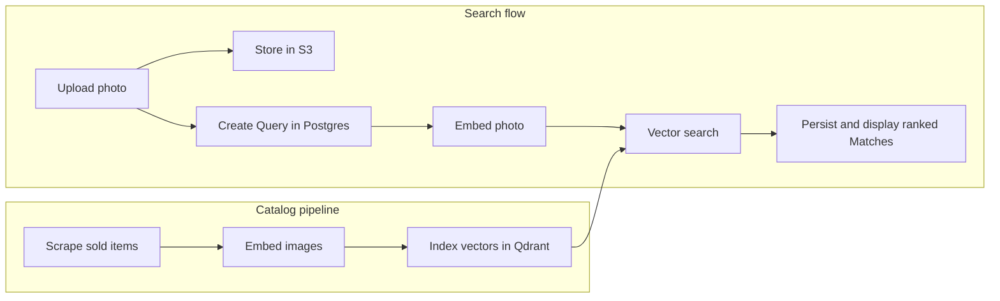

# Examen

### Visual search for sold auction items

Examen turns an uploaded photo into a ranked list of visually similar items from Auctionet's sold archive. It combines multimodal embeddings with vector search, then returns each match with its realized price and original listing.

Built as a full-stack thesis project—from data collection and embedding pipelines to search, persistence, and deployment.

## Highlights

- Built an end-to-end image retrieval pipeline: scrape, normalize, embed, index, search, and rank.
- Designed semantic image search with 3072-dimensional Gemini embeddings and cosine similarity in Qdrant.
- Separated storage by responsibility: vectors in Qdrant, application state in Postgres, and user uploads in S3.
- Preserved historical match metadata in Postgres so results remain stable if the source catalog changes.
- Documented consequential design choices as [architecture decision records](./docs/adr/).

## Tech stack

**Frontend:** Next.js 16, React 19, TypeScript, Tailwind CSS, Motion  
**Backend:** Next.js Route Handlers, Drizzle ORM, PostgreSQL  
**Search & AI:** Qdrant, Gemini multimodal embeddings via OpenRouter  
**Infrastructure:** S3-compatible object storage, Railway  
**Quality:** Vitest, Testing Library, ESLint, Prettier

## How it works


```mermaid
flowchart LR
  subgraph Catalog pipeline
    A[Scrape sold items] --> B[Embed images]
    B --> C[Index vectors in Qdrant]
  end

  subgraph Search flow
    D[Upload photo] --> E[Store in S3]
    D --> F[Create Query in Postgres]
    F --> G[Embed photo]
    G --> H[Vector search]
    H --> I[Persist and display ranked Matches]
  end

  C --> H
```

Reference images remain on Auctionet's CDN. Only user uploads are stored in S3, avoiding duplicate media storage.

## Run locally

### Prerequisites

- Node.js 20+
- pnpm
- PostgreSQL
- Qdrant
- S3-compatible object storage
- OpenRouter API key

### Setup

```bash
pnpm install

# Create .env with the variables below
pnpm exec drizzle-kit push
pnpm dev
```

Open [localhost:3000](http://localhost:3000).

```bash
DATABASE_URL=postgresql://...
QDRANT_URL=https://...
OPENROUTER_API_KEY=...
AWS_REGION=...
AWS_ACCESS_KEY_ID=...
AWS_SECRET_ACCESS_KEY=...
AWS_BUCKET_NAME=...
# Optional for Railway Buckets / other S3-compatible stores:
# AWS_ENDPOINT_URL=https://storage.railway.app
```

## Build the searchable catalog

```bash
# Scrape only (Auctionet → bucket)
pnpm cron -- --stages scrape --category 9-ceramics-porcelain

# Embed + store Vector Artifacts in the bucket (no scrape, no Qdrant)
pnpm cron -- --stages embed,store --category 9-ceramics-porcelain

# Embed + store + upsert Qdrant
pnpm cron -- --stages embed,store,upsert --category 9-ceramics-porcelain

# Or run individual scripts after local item JSON exists:
pnpm embed -- \
  --items data/auctionet/items/9-ceramics-porcelain \
  --out data/auctionet/items/9-ceramics-porcelain/vectors

pnpm upsert -- \
  --vectors data/auctionet/items/9-ceramics-porcelain/vectors \
  --items data/auctionet/items/9-ceramics-porcelain
```

`--stages` accepts any comma list of `scrape`, `embed`, `store`, `upsert` (default: all four). Bucket→local sync is implicit whenever embed, store, or upsert is selected.

### Daily automation on Railway

`pnpm cron` runs the selected stages for each configured Auctionet Category:

1. **scrape** — Auctionet Item JSON to the bucket (`HeadObject` skip)
2. Sync items down from the bucket (implicit when embed/store/upsert run)
3. **embed** — reuse Vector Artifacts already in Qdrant or the bucket; embed only the rest
4. **store** — Vector Artifacts to the bucket (`HeadObject` skip)
5. **upsert** — Qdrant upsert (skip artifacts whose deterministic point IDs already exist)

Create **separate** Railway services for cron (do not put schedules on the web app):

- Scrape-only: point at `railway.scrape.toml` — every 30 minutes, `--stages scrape`

```bash
# Local dry run of the orchestrator
pnpm cron -- --dry-run --max-pages 1 --max-items 5

# Scrape-only (same as railway.scrape.toml)
pnpm cron -- --stages scrape --mode incremental --max-items 500
```

Extra env for the cron services (in addition to the app vars; embed/upsert also need OpenRouter/Qdrant):

```bash
AWS_ENDPOINT_URL=https://storage.railway.app   # from the Railway Bucket credentials
# Optional: override the default (full Auctionet leaf taxonomy, company 232 URLs).
# Omit CATALOG_CATEGORIES to scrape every leaf.
# CATALOG_CATEGORIES=9-ceramics-porcelain,28-paintings
# Optional override with a custom listing URL:
# CATALOG_CATEGORIES=28-paintings|https://auctionet.com/en/search/28-paintings?is=ended
```

Bucket keys live under `scrape/...` so they never collide with Query image Keys. See [ADR 0008](./docs/adr/0008-daily-catalog-pipeline-on-railway.md).

## Project documentation

- [Domain model](./CONTEXT.md)
- [Architecture decisions](./docs/adr/)
- [Qdrant selection](./docs/adr/0002-qdrant-for-vector-storage.md)
- [Match generation lifecycle](./docs/adr/0003-page-driven-match-generation.md)
- [Deterministic vector IDs](./docs/adr/0004-deterministic-qdrant-reference-point-ids.md)
- [Daily catalog pipeline](./docs/adr/0008-daily-catalog-pipeline-on-railway.md)

## Scripts

```bash
pnpm dev                        # Start the development server
pnpm build                      # Create a production build
pnpm test                       # Run tests
pnpm lint                       # Run ESLint
pnpm scrape                     # Collect sold Auctionet items
pnpm embed                      # Generate catalog embeddings
pnpm upsert                     # Upsert References into Qdrant
pnpm cron                       # Stages: scrape → embed → store → upsert
```
