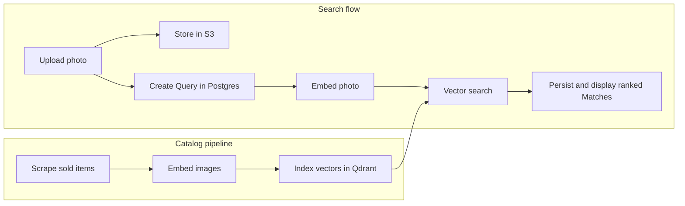

# Examen

### Visual search for sold auction items

Examen turns an uploaded photo into a ranked list of visually similar items from Auctionet's sold archive. It combines multimodal embeddings with vector search, then returns each match with its realized price and original listing.

Built as a full-stack thesis project—from data collection and embedding pipelines to search, persistence, and deployment.

## Highlights

- Built an end-to-end image retrieval pipeline: scrape, normalize, embed, index, search, and rank.
- Designed semantic image search with 3072-dimensional Gemini embeddings and cosine similarity in Qdrant.
- Separated storage by responsibility: vectors in Qdrant, application state in Postgres, and user uploads in S3.
- Preserved historical match metadata in Postgres so results remain stable if the source catalog changes.
- Documented consequential design choices as [architecture decision records](./docs/adr/).

## Tech stack

**Frontend:** Next.js 16, React 19, TypeScript, Tailwind CSS, Motion  
**Backend:** Next.js Route Handlers, Drizzle ORM, PostgreSQL  
**Search & AI:** Qdrant, Gemini multimodal embeddings via OpenRouter  
**Infrastructure:** S3-compatible object storage, Railway  
**Quality:** Vitest, Testing Library, ESLint, Prettier

## How it works


```mermaid
flowchart LR
  subgraph Catalog pipeline
    A[Scrape sold items] --> B[Embed images]
    B --> C[Index vectors in Qdrant]
  end

  subgraph Search flow
    D[Upload photo] --> E[Store in S3]
    D --> F[Create Query in Postgres]
    F --> G[Embed photo]
    G --> H[Vector search]
    H --> I[Persist and display ranked Matches]
  end

  C --> H
```

Reference images remain on Auctionet's CDN. Only user uploads are stored in S3, avoiding duplicate media storage.

## Run locally

### Prerequisites

- Node.js 20+
- pnpm
- PostgreSQL
- Redis
- Qdrant
- S3-compatible object storage
- OpenRouter API key

### Setup

```bash
pnpm install

# Create .env with the variables below
pnpm exec drizzle-kit push
pnpm dev
```

Open [localhost:3000](http://localhost:3000).

```bash
DATABASE_URL=postgresql://...
REDIS_URL=redis://...
QDRANT_URL=https://...
OPENROUTER_API_KEY=...
AWS_REGION=...
AWS_ACCESS_KEY_ID=...
AWS_SECRET_ACCESS_KEY=...
AWS_BUCKET_NAME=...
# Optional for Railway Buckets / other S3-compatible stores:
# AWS_ENDPOINT_URL=https://storage.railway.app

# PostHog product analytics, error tracking, logs, and traces:
NEXT_PUBLIC_POSTHOG_PROJECT_TOKEN=phc_...
NEXT_PUBLIC_POSTHOG_HOST=https://eu.i.posthog.com # or https://us.i.posthog.com

# Optional build-only source map upload (never expose POSTHOG_API_KEY):
POSTHOG_API_KEY=phx_...
POSTHOG_PROJECT_ID=...
```

PostHog is disabled when `NEXT_PUBLIC_POSTHOG_PROJECT_TOKEN` is unset. The
source map integration is enabled only when both build-only variables are set;
the personal key needs Error Tracking write access.

The integration records page views, web vitals, browser/server exceptions,
structured operational logs, request traces, upload and matching timings,
deletions, rate-limit failures, and result opens. It deliberately excludes raw
images, filenames, signed URLs, embeddings, request/response bodies, and
credentials. Inputs are masked in session replay and uploaded images are
blocked from replay capture.

## Build the searchable catalog

```bash
# Scrape only (Auctionet → bucket)
pnpm cron -- --stages scrape --category 9-ceramics-porcelain

# Embed + store Vector Artifacts in the bucket (no scrape, no Qdrant)
pnpm cron -- --stages embed,store --category 9-ceramics-porcelain

# Embed + store + upsert Qdrant
pnpm cron -- --stages embed,store,upsert --category 9-ceramics-porcelain

# One-shot: rewrite existing Qdrant payloads (e.g. after adding Sold At). Do not use on scheduled cron.
pnpm cron -- --stages upsert --force

# Or run individual scripts after local item JSON exists:
pnpm embed -- \
  --items data/auctionet/items/9-ceramics-porcelain \
  --out data/auctionet/items/9-ceramics-porcelain/vectors

pnpm upsert -- \
  --vectors data/auctionet/items/9-ceramics-porcelain/vectors \
  --items data/auctionet/items/9-ceramics-porcelain
```

`--stages` accepts `scrape`, `embed`, `store`, and `upsert` (default: all four). Cron embedding requires `store`: each generated Vector Artifact is uploaded immediately. The scheduled embed/store/upsert pipeline reads bucket JSON into memory and does not create local item or vector files. Standalone `pnpm embed` and `pnpm upsert` still work with local files; `pnpm cron -- --stages store` uploads existing local artifacts as an explicit recovery command.

### Cron script usage

Run commands from the project root after `pnpm install`, with credentials in `.env` or the environment. The same commands work locally and as Railway service start commands. `pnpm cron` runs once and exits; Railway controls the schedule.

```bash
pnpm cron -- --help
```

Bucket access needs `AWS_REGION`, `AWS_ACCESS_KEY_ID`, `AWS_SECRET_ACCESS_KEY`, and `AWS_BUCKET_NAME`; set `AWS_ENDPOINT_URL` for Railway Buckets or another S3-compatible endpoint. Creating new embeddings also needs `OPENROUTER_API_KEY`. Selecting `upsert` needs `QDRANT_URL` and `QDRANT_API_KEY` if Qdrant requires authentication. Scrape-only and embed/store-only runs do not require Qdrant.

#### All flags and defaults

| Flag | Default | Behavior |
| --- | --- | --- |
| `--category <segment>` | `CATALOG_CATEGORIES`, otherwise all built-in leaf categories | Select an Auctionet Category, such as `9-ceramics-porcelain`. Repeat the flag to select multiple categories. For a custom scrape URL, pass a quoted `"segment\|url"` value. |
| `--stages <list>` | `scrape,embed,store,upsert` | Comma-separated stages, executed in pipeline order. `embed` requires `store`. `store` without `embed` or `upsert` uploads existing local artifacts from `data/auctionet/items/<category>/vectors`. `upsert` without `embed` reads existing bucket artifacts. |
| `--mode <backfill\|incremental>` | `backfill` | Scrape strategy. `backfill` tries multiple archive sort orders to collect older items. `incremental` starts with recent sales and stops after a page whose items are all already in the bucket. Applies only when `scrape` is selected. |
| `--max-items <n>` | Unlimited | Limit newly saved scraped items across all selected categories; existing items do not count. In upsert-only runs, cap artifacts checked per category, including skipped artifacts. This flag does not limit embedding work. |
| `--max-pages <n>` | Unlimited | Limit scrape listing pages per sort order, per category. Applies only to `scrape`; backfill can use several sort orders, so this is not a total page limit for the run. |
| `--max-embed-items <n>` | Unlimited | Limit new embedding attempts across all selected categories. One item includes all of its images. Failed attempts consume a slot; saved artifacts, fully indexed items, and unsold items do not. |
| `--retry-failed` | Off | Process only items with failure records in the bucket. Defaults to `embed,store,upsert` when `--stages` is omitted. Requires `embed,store` and cannot include `scrape`. Successfully saved embeddings remove their failure record. |
| `--dry-run` | Off | Preview work without paid embedding calls or writes, including changes to failure records. Indexing previews read the real bucket and Qdrant when selected, so they need credentials and network access. Scrape and store-only previews print the planned actions. |
| `--force` | Off | Rewrite Qdrant points and payloads from saved vectors when `upsert` is selected. Does not force re-scraping or re-embedding. Fully indexed items without a saved bucket artifact remain skipped. |
| `--discover-leaves` | Off | Fetch the Auction House's current leaf categories from Auctionet instead of using `--category`, `CATALOG_CATEGORIES`, or the built-in list. With `--dry-run`, use the built-in categories without fetching facets. |
| `--company-id <n>` | `232` (Crafoord Stockholm) | Auctionet company used by `--discover-leaves`. Has no effect without that flag. To change a scrape URL without discovery, use `--category "segment\|url"`. |
| `--help`, `-h` | — | Print the command's usage and exit. |

All numeric limits and company IDs must be positive integers. CLI runs are uncapped unless you set limits; the Railway service commands explicitly set their own budgets. Category selection uses discovered leaves first, then repeated `--category` values, then `CATALOG_CATEGORIES`, then the built-in leaf list. `CATALOG_CATEGORIES` accepts comma-separated segments or `segment|url` entries.

#### Common commands

**Preview indexing for one category.** Read the bucket and Qdrant and plan up to five new embeddings without changing anything.

```bash
pnpm cron -- --dry-run --stages embed,store,upsert \
  --category 9-ceramics-porcelain --max-embed-items 5
```

**Run a bounded full pipeline for one category.** Scrape up to 100 new items, then embed, store, and index up to 20 new items. Embedding can include previously scraped items already waiting in the bucket.

```bash
pnpm cron -- --category 9-ceramics-porcelain \
  --max-items 100 --max-embed-items 20
```

**Backfill the archive into the bucket.** Scrape up to 500 new items across the configured categories. This matches the scheduled scrape service.

```bash
pnpm cron -- --stages scrape --mode backfill --max-items 500
```

**Collect recent sales.** Use after the archive backfill; stop when a full page is already in the bucket, or after saving 100 new items.

```bash
pnpm cron -- --stages scrape --mode incremental --max-items 100
```

**Try a small scrape.** Inspect one category with at most two pages per backfill sort order and ten newly saved items.

```bash
pnpm cron -- --stages scrape --category 9-ceramics-porcelain \
  --max-pages 2 --max-items 10
```

**Index items already in the bucket.** Create up to 50 new embeddings across the configured categories, save each artifact, and upsert its Qdrant points. Rerunning resumes unfinished work and reuses saved vectors. This matches the scheduled embed service.

```bash
pnpm cron -- --stages embed,store,upsert --max-embed-items 50
```

**Embed and save vectors before Qdrant is available.** Process one category with a 20-item embedding budget.

```bash
pnpm cron -- --stages embed,store \
  --category 9-ceramics-porcelain --max-embed-items 20
```

**Retry failed embeddings.** Select only bucket failure records, with up to 20 new embedding attempts. Saved or already indexed items clear stale records without another embedding call. Omit `--category` to retry across the configured categories, or add `--dry-run` to preview.

```bash
pnpm cron -- --retry-failed \
  --category 9-ceramics-porcelain --max-embed-items 20
```

**Recover Qdrant from saved bucket vectors.** Upsert one category without making embedding calls. Add `--max-items 100` to check at most 100 artifacts in that category.

```bash
pnpm cron -- --stages upsert --category 9-ceramics-porcelain
```

**Refresh Qdrant metadata.** Run once after changing the payload format, using saved vectors without re-embedding.

```bash
pnpm cron -- --stages upsert --force --category 9-ceramics-porcelain
```

**Upload vectors made by the local embed script.** Upload existing local artifacts to the bucket, then index them in a second run.

```bash
pnpm cron -- --stages store --category 9-ceramics-porcelain
pnpm cron -- --stages upsert --category 9-ceramics-porcelain
```

**Select several categories.** Both categories share the 50-item embedding budget in this process.

```bash
pnpm cron -- --stages embed,store,upsert \
  --category 9-ceramics-porcelain --category 6-glass --max-embed-items 50
```

**Use a custom scrape URL.** Quote the entire `segment|url` value so the shell preserves the pipe and query parameters.

```bash
pnpm cron -- --stages scrape \
  --category '28-paintings|https://auctionet.com/en/search/28-paintings?is=ended&company_id=232' \
  --max-items 100
```

**Discover the Auction House's current categories.** Discover leaves for company 232 and scrape up to 100 new items across them.

```bash
pnpm cron -- --discover-leaves --company-id 232 \
  --stages scrape --mode incremental --max-items 100
```

Use one active indexing worker per category, including local runs and Railway services. For parallel workers, assign different categories as shown below under [Scheduled automation on Railway](#scheduled-automation-on-railway). Indexing stops on the first error; failures before vectors are saved enter the bucket retry list described next.

The bucket is the source of truth for failed embeddings, including when `pnpm embed` runs locally. Each failed item has one JSON record under `scrape/<category>/failures/<shard>/<auctionet-id>.json`, containing its item bucket key, latest error, and failure timestamp. Failures before vectors are saved (including item validation and artifact upload errors) are recorded. Repeated failures update the same record; saving the vectors successfully removes it. Saved artifacts and fully indexed items also clear stale records without another embedding call. A later Qdrant write failure uses the saved artifact for ordinary recovery and is not an embedding failure. Local embedding now requires the same bucket credentials as cron; its vector output remains local.

Retry only items recorded as failed in the bucket:

```bash
# Bucket items: defaults to embed,store,upsert, with no scraping
pnpm cron -- --retry-failed --category 9-ceramics-porcelain

# Local items: retry matching local JSON, sharing the same bucket failure records
pnpm embed -- \
  --items data/auctionet/items/9-ceramics-porcelain \
  --out data/auctionet/items/9-ceramics-porcelain/vectors \
  --retry-failed
```

`--retry-failed` also supports `--dry-run`, which never adds, updates, or deletes failure records. An empty failure list does no embedding work. Normal runs still process unfinished items and clear failures they resolve. Failures from earlier terminal logs are not automatically backfilled; they enter the bucket when encountered on a new run. If writing or clearing a failure record fails, the run reports the bucket error instead of silently losing retry state.

### Scheduled automation on Railway

`pnpm cron` runs the selected stages for each configured Auctionet Category:

1. **scrape** — Auctionet Item JSON to the bucket (`HeadObject` skip)
2. List bucket keys page by page and read one item JSON into memory
3. Check expected Qdrant point IDs; skip fully indexed items when upsert is selected
4. **embed** — reuse a saved bucket Vector Artifact, or embed all images of the sold item
5. **store** — upload each new Vector Artifact immediately, before its Qdrant write
6. **upsert** — upsert that artifact with item metadata and deterministic point IDs, then move to the next item

Railway services, including their start commands and cron schedules, are defined in [`.railway/railway.ts`](.railway/railway.ts) (Railway Infrastructure as Code). Preview changes with `railway config plan`, then apply with `railway config apply`. Cron runs on **separate** services, not the web app:

- `scrape`: every 30 minutes, `--stages scrape`
- `embed` (catalog indexing): hourly on the hour (UTC), `--stages embed,store,upsert --max-embed-items 50`. Each run embeds up to 50 new items across all categories, including every image of each item (50 items with 5 images each = 250 images). Existing vectors, fully indexed items, and unsold items do not consume the budget. Failed embedding attempts consume a slot; a failed item stops the run visibly. Give it the same bucket credentials, `OPENROUTER_API_KEY`, `QDRANT_URL`, and `QDRANT_API_KEY`.

For the initial catch-up, run one category first, then the full backlog:

```bash
pnpm cron -- --stages embed,store,upsert --category 9-ceramics-porcelain
pnpm cron -- --stages embed,store,upsert
```

Use the same `CATALOG_CATEGORIES` as the scraper, or leave it unset for all supported leaves. Check each stage's summary for zero failures and confirm new references appear in Qdrant before enabling the hourly schedule. Run only one active indexing worker per category to avoid duplicate embedding charges. The scraper can continue separately.

Existing bucket vectors are reused. When upsert is selected, fully indexed items are skipped without reading or regenerating their vector artifacts, including items whose bucket artifact is missing. Embed/store-only runs reuse saved artifacts without requiring Qdrant. Do not use `--force` or `--recreate` for ordinary catch-up. Upsert-only runs read existing bucket artifacts; `--force` rewrites their Qdrant points and payloads without regenerating vectors.

Use `--max-embed-items 50` to limit new embedding attempts across categories in one process, or omit it for an uncapped manual catch-up. Existing vectors, fully indexed items, and unsold items do not consume this budget. The last budgeted item is uploaded and upserted before stopping. `--max-items` controls scraping and caps artifacts checked per category in upsert-only runs; it does not cap the combined embedding pipeline. A cron indexing dry run now reads the real bucket and checks Qdrant (credentials and network access are required), but never calls OpenRouter, writes objects, creates collections, or upserts points. It reports planned work, not an exact monetary cost. Scrape dry runs only print the scrape command.

Each completed embedding is saved to the bucket immediately. If Qdrant fails, the next run reuses that artifact without paying to embed it again. Bucket read failures are errors, not missing artifacts. Upload failures stop the run before upserting; embeddings whose upload never succeeded may need to be generated again. Progress includes bucket listing pages, item reads, duplicate decisions, image batches, uploads, upserts, elapsed time, counts, and remaining embedding budget.

For parallel indexing, start separate workers with distinct categories, initially two or three workers:

```bash
# Worker 1
pnpm cron -- --stages embed,store,upsert --category 1-lighting-lamps --max-embed-items 50
# Worker 2 (separate terminal or Railway service)
pnpm cron -- --stages embed,store,upsert --category 6-glass --max-embed-items 50
```

Assign disjoint categories with `--category` or `CATALOG_CATEGORIES`. Do not run an all-category worker alongside these workers. There is no shared lock: each category must have only one active indexing worker, including local runs. Budgets apply per worker (two workers with a limit of 50 can embed 100 items total). Workers share provider rate limits and Qdrant capacity; the existing embedding retry logic handles `429` and `Retry-After` responses.

```bash
# Read-only bucket/Qdrant preview for one category
pnpm cron -- --dry-run --stages embed,store,upsert --category 1-lighting-lamps --max-embed-items 5

# Scrape-only (same as the scrape service)
pnpm cron -- --stages scrape --mode backfill --max-items 500
```

Extra env for the cron services (in addition to the app vars; embed/upsert also need OpenRouter/Qdrant):

```bash
AWS_ENDPOINT_URL=https://storage.railway.app   # from the Railway Bucket credentials
# Optional: override the default (full Auctionet leaf taxonomy, company 232 URLs).
# Omit CATALOG_CATEGORIES to scrape every leaf.
# CATALOG_CATEGORIES=9-ceramics-porcelain,28-paintings
# Optional override with a custom listing URL:
# CATALOG_CATEGORIES=28-paintings|https://auctionet.com/en/search/28-paintings?is=ended
```

Bucket keys live under `scrape/...` so they never collide with Query image Keys. See [ADR 0008](./docs/adr/0008-daily-catalog-pipeline-on-railway.md).

## Project documentation

- [Domain model](./CONTEXT.md)
- [Architecture decisions](./docs/adr/)
- [Qdrant selection](./docs/adr/0002-qdrant-for-vector-storage.md)
- [Match generation lifecycle](./docs/adr/0003-page-driven-match-generation.md)
- [Deterministic vector IDs](./docs/adr/0004-deterministic-qdrant-reference-point-ids.md)
- [Scheduled catalog pipeline](./docs/adr/0008-daily-catalog-pipeline-on-railway.md)

## Scripts

```bash
pnpm dev                        # Start the development server
pnpm build                      # Create a production build
pnpm test                       # Run tests
pnpm lint                       # Run ESLint
pnpm scrape                     # Collect sold Auctionet items
pnpm embed                      # Generate catalog embeddings
pnpm upsert                     # Upsert References into Qdrant
pnpm cron                       # Stages: scrape → embed → store → upsert
```

The scheduled scrape uses backfill with a 500-new-item budget. Every category is traversed in oldest/newest end-date and ascending/descending estimate order to reach beyond an individual listing’s page cap. Duplicate Auctionet IDs are skipped within the run and existing item objects are skipped in the bucket. Runs restart listings rather than persisting page positions. An uncapped, unbudgeted completion must cover the advertised count; otherwise scraping fails visibly instead of silently accepting an incomplete archive. Sort-order unions cannot guarantee coverage for arbitrarily large categories; such failures require narrower filters.
